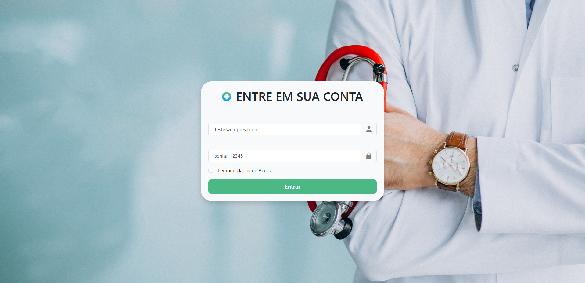

# 🗂️ Sistema de Prontuário de Atletas

Sistema web desenvolvido como Jovem Aprendiz, com o objetivo de gerenciar prontuários de atletas de forma simples, organizada e acessível. A aplicação permite cadastrar, editar, excluir e buscar prontuários, além de fazer upload e download de documentos.

## 🚀 Tecnologias Utilizadas

- Python (Flask)
- HTML5
- CSS3
- Bootstrap
- SQLite

## 💻 Funcionalidades

- ✅ Tela de login com validação de credenciais
- ✅ Cadastro de novos prontuários
- ✅ Edição e exclusão de registros existentes
- ✅ Upload e download de documentos (PDFs, imagens etc.)
- ✅ Filtros para localizar prontuários específicos
- ✅ Interface responsiva para dispositivos móveis e desktops

## 📸 Imagens

> *(Adicione imagens na pasta `screenshots/` e atualize os caminhos abaixo)*




## 🧪 Como executar o projeto localmente

1. Clone o repositório:
   ```bash
   git clone https://github.com/seu-usuario/nome-do-repositorio.git
   cd nome-do-repositorio
