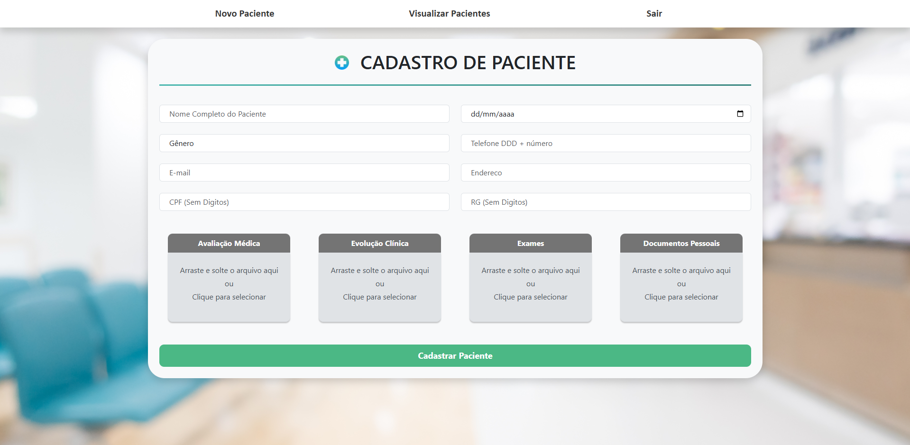
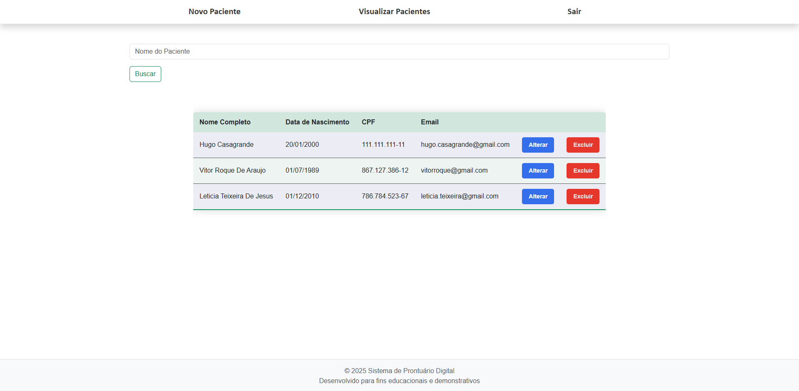
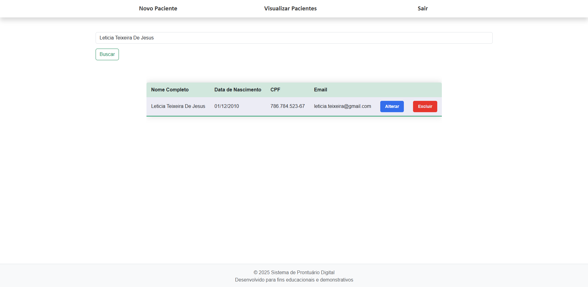
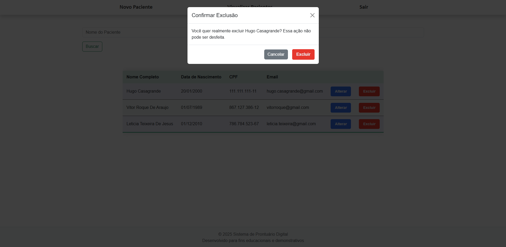

```
# 🗂️ Sistema de Prontuário de Pacientes

Sistema de prontuário eletrônico para clínicas e profissionais da saúde, desenvolvido com Flask e foco em usabilidade e organização de dados médicos.

Sistema web responsivo desenvolvido com o objetivo de gerenciar prontuários de pacientes de forma simples, organizada e acessível.  
A aplicação permite cadastrar, editar, excluir e buscar prontuários (CRUD), além de fazer upload e download de documentos.

## 🚀 Tecnologias Utilizadas

* Python (Flask)
* HTML5
* CSS3
* Bootstrap
* SQLite

## 💻 Funcionalidades

* ✅ Tela de login com validação de credenciais
* ✅ Cadastro de novos prontuários
* ✅ Edição e exclusão de registros existentes
* ✅ Upload e download de documentos (PDFs, imagens etc.)
* ✅ Filtro por nome com campo de busca para localizar prontuários
* ✅ Interface responsiva para dispositivos móveis e desktops

## 📁 Estrutura de Pastas

```

Prontuario-de-Pacientes/
├── static/
│   ├── css/
│   ├── fotos\_gerais/
│   └── ...
├── templates/
│   ├── base.html
│   ├── login.html
│   └── ...
├── spfcproject/
│   ├── **init**.py
│   ├── routes.py
│   ├── forms.py
│   └── models.py
├── main.py
├── create-db.py
├── requirements.txt
└── README.md

````

## 📸 Imagens

  
  
  
  
  


## 🧪 Como executar o projeto localmente

Siga os passos abaixo para rodar o projeto no seu ambiente:

1. **Crie uma nova pasta** e abra em uma IDE (recomendado: [Visual Studio Code](https://code.visualstudio.com/)).

2. **Crie um ambiente virtual (opcional, mas recomendado):**

   ```bash
   python -m venv venv
````

Ative o ambiente virtual:

* No **Windows** (cmd ou PowerShell):

  ```bash
  venv\Scripts\activate
  ```

> ⚠️ Se a execução estiver desabilitada no PowerShell, execute:
>
> ```powershell
> Set-ExecutionPolicy -ExecutionPolicy RemoteSigned -Scope CurrentUser
> ```

3. **Clone este repositório (requer o Git instalado):**

   ```bash
   git clone https://github.com/nicolasandreos/Prontuario-de-Pacientes.git
   cd Prontuario-de-Pacientes
   ```

4. **Instale as dependências do projeto:**

   ```bash
   pip install -r requirements.txt
   ```

5. **Crie o banco de dados e um usuário inicial para login:**

   Execute o script `create-db.py`:

   ```bash
   python create-db.py
   ```

   > Após a execução, será criado um usuário padrão com:
   >
   > * **Email:** `teste@empresa.com`
   > * **Senha:** `12345`

6. **Execute o projeto:**

   ```bash
   python main.py
   ```

   Acesse o sistema através do link gerado no terminal (geralmente `http://127.0.0.1:5000`).

---

## 📄 Licença

Este projeto está licenciado sob a licença [MIT](LICENSE).

```

---

Se quiser, posso gerar esse arquivo e te enviar para você só colar no projeto. Deseja isso também?
```
